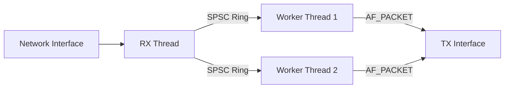

# UPE Architecture Guide

## High-Level Overview

The system follows a **Pipeline Architecture**:



## 1. Memory Management

### Design

The memory pool uses a **lock-free** design to avoid mutex contention between threads.

We use two-tier allocation strategy:
*   **Global Pool**: Lock-free array-based stack using atomic Compare-And-Swap (CAS) operations. No mutex.
*   **Thread-Local Cache (LIFO):** Each thread (each worker) has a private cache of 64 buffer pointers using `_Thread_local` storage.
    *   **Allocation**: Threads first check their local cache (no atomics). If empty, they grab 32 buffers from the global pool using atomic CAS.
    *   **Deallocation**: Threads push to their local cache (no atomics). If cache is full, they flush 32 buffers back to the global pool via atomic CAS.

### Lock-Free Implementation

The global pool uses `atomic_compare_exchange_weak_explicit` instead of mutexes:

*   **Pop (refill)**: Atomically decrement `top`, then copy pointers from `free_stack[new_top..old_top]`.
*   **Push (flush)**: Speculatively write pointers to `free_stack[old_top..]`, then atomically increment `top` via CAS. The write-before-CAS order is critical: if we incremented `top` first, another thread could pop from our reserved range before we finished writing the pointers.
*   On success, using `memory_order_acq_rel` we can make sure that the buffer pointers are visible to other threads.
*   On failure, we use `memory_order_acquire` to get the latest state.

### Huge Pages

The buffer array is allocated using `mmap` with 2MB huge pages to reduce TLB usage from many 4KB entries to a few entries (2MB pages).

It requires pre-allocated huge pages. If missing, then `mmap` with regular pages are used. If that's failing, then we're falling back to `calloc` (standard heap allocation).

### Key functions

*   **`pktbuf_pool_init`**: Pre-allocates all buffers in a single contignous block. Initializes the free stack with pointers to all buffers.
*   **`pktbuf_alloc`**: Fast path returns buffers from the local cache. Slow path calls `global_pop_bulk` (atomic CAS).
*   **`pktbuf_free`**: Fast path adds to local cache. Slow path calls  `global_push_bulk` (atomic CAS).

---

## 2. Ingress & Handoff

### Design
To decouple the RX thread (I/O) from the Workers (CPU), we use **Single-Producer / Single-Consumer (SPSC) ring buffers**.

*   **Topology:** 1 RX Thread feeds $N$ Workers via $N$ distinct rings.
*   **Data Transfer:** Only the 8-byte pointer (`pktbuf_t*`) is passed through the ring. The packet data stays in the pre-allocated buffer.
*   **Software RSS:** The RX thread calculates a symmetric 5-tuple hash (SrcIP, DstIP, SrcPort, DstPort,, Proto) to pick the destination ring. This ensures bidirectional flows (c2s and s2c) always land on the same worker.
*   **Burst Processing:**
    *   RX maintains per-ring staging buffers (size 32) that accumulate packets.
    *   When a buffer fills or pcap times out (1ms), packets are flushed via `ring_push_burst`.
    *   Workers dequeue packets in batches using `ring_pop_burst` (up to 32 at a time).
*   **Lock Free Implementation:**
    *   Uses C11 `stdatomic` with acquire/release memory ordering.
    *   `memory_order_release` (Producer): Makes sure data is written before updating the  head index.
    *   `memory_order_acquire` (Consumer): Makes sure consumer sees the head update before reading data.
    *   No mutexes or syscalls in the hot path, RX and workers never block each other.
---

## 3. Parser

The parser extracts flow information (5-tuple) from raw packet data. It is used by both the RX thread (for RSS hashing) and Workers (for Rule matching).

### Design
*   **Zero-Copy:** Reads headers directly from the buffer without copying.
*   **Dual-Stack:** Handles both IPv4 and IPv6.

### IPv6 Implementation Details
*   IPv6 addresses are stored as `uint8_t[16]` inside a `union`. We use `memcpy` to extract them instead of pointer casting for two reasons:
    *   1. **Alignment safety**: The Ethernet header is 14 bytes, so the IPv6 header starts at an offset not divisible by 4 or 8. Accessing it as `uint64_t*` or `uint128_t*` would cause unaligned memory access, which triggers a bus error on some architectures. `memcpy` handles this safely.
    *   2. **Endianness**: Byte arrays represent data exactly as it appears on the wire, which makes debugging easier compared to integers that get byte-swapped on little-endian CPUs.

    For hashing, we pack the 128-bit address into 32 bits by splitting it into four 32-bit chunks and XORing them together. This preserves entropy while fitting the ring selection logic.

---

## 4. Workers

Workers implement the data plane. They're designed to be as independent as possible, though they share the global memory pool.

*   **Per-Worker State:**
    *   `rx_ring`: Dedicated input ring (no sharing).
    *   `rule_stats`: Private array of counters (lock-free increments).
    *   L1 caches for ADP/NDP lookups (single-entry, avoids lock contention).
*   **Shared State:**
    *   Read-only: Rule table, TX context.
    *   Write (synchronized): Global packet pool.

**Processing Loop:**
*   1. Pop up to 32 packets at once using `ring_pop_burst`.
*   2. For each packet:
    *   Check if it's a control packet (ARP/NDP) and learn MAC address.
    *   Parse the 5-tuple.
    *   Match against rules.
    *   For forwarded packets: decrement TTL/hop-limit, update checksums, rewrite MAC and addresses, then transmit.
    *   Dropped/consumed packets are freed right away.
    3. Flush TX batch: Accumulated frames are sent in a single sendmmsg() syscall.
*   4. Sleeps for 1μs if the ring is empty so the CPU is not spinning.

**Stats:** Counters are incremented without atomics since each worker has private memory. Stats thread aggregates them periodically.

---

## 5. Policy

### Design
Rule matcher is a simple linear array of rules sorted by priority. `rule_table_match` iterates through the list until it finds a match. First match wins.

Workers can read the rule table without any locks during the packet processing.

### Dual-Stack
Both IPv4 and IPv6 addresses are supported.

Wildcards are supported by giving all zeros masks.

### Rule configuration
Rules can be loaded from INI formatted config files using `--rules <file>`.

---

## 6. Observability

A seperate stats thread wakes up every second to aggregate and  display counters. It loops through all worker structures and sums their private `rule_stats` arrays.

The design keeps aggregation complexity out of the packet processing path. Workers just increment their local counters, and stats thread handles the rest. There's no locking.

---

## 7. CPU Affinity

Each thread is pinned to a dedicated CPU core using `pthread_setaffinity_np` to maximize cache locality and minimize thread migration overhead.

### Core Assignment

*   **On a 4-core system with 2 workers:**
    *   Core 0: RX thread (main)
    *   Core 1: Worker 0
    *   Core 2: Worker 1
    *   Core 3: Stats thread

The assignment is **sequential** (consecutive cores starting from 0). This works well for:
- **Single-socket sytems**: All cores share the same L3 cache and memory controller
- **Multi-socket systems with cores 0-N on socket 0**: Threads stay on the same socket by default

**Note:** The current implementation does not query NUMA topology. If you are running on a multi-socket system and you care about NUMA performance, you should manually check (using `lscpu` or `/sys/devices/system/node`) that cores 0-3 are actually on the same socket. The code does not do this automatically.

### Why This is Important

**Cache Locality:**
- Each CPU core has private L1/L2 caches (≈32KB / ≈256KB, ~1–5 ns access latency)
- When threads migrate between cores, private caches (L1/L2) go cold
- After migration, data is typically served from shared L3 (~10–20 ns), via cache-to-cache transfer from other core, or worst case from DRAM (~70-100 ns), instead of L1
- With pinning we can keep the hot data (rule table, ARP cache, flow state) in L1/L2

**NUMA on Multi-Socket Systems:**
- Local NUMA node memory access: ~70–90 ns
- Remote (cross-socket) NUMA memory access: typically ~120–160 ns
- Binding threads to the same NUMA node as their memory help with the latency

### Implementation

Threads pin themselves immediately on startup so that all memory initialization performed by the thread occurs after CPU affinity is set. This guarantees that **NUMA first-touch placement** allocates pages on the NUMA node local to the pinned CPU.

```c
static void *worker_main(void *arg) {
    worker_t *w = (worker_t *)arg;

    if (w->core_id >= 0) {
        affinity_pin_self(w->core_id);
    }
}
```

Affinity is skipped gracefully with a warning if `affinity_get_num_cores()` fails (i.e, not enough cores).

Check affinity with:

```bash
# While upe is running:
grep "Cpus_allowed_list" /proc/$(pgrep upe)/task/*/status
```

Each thread should show a single core number in its allowed list.

---
