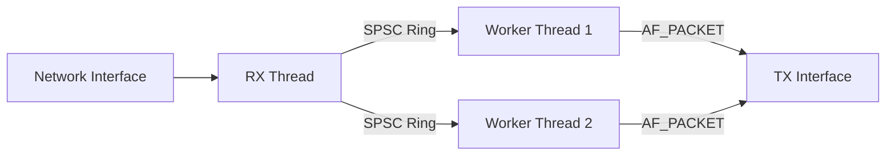

# UPE Architecture Guide

## High-Level Overview

The system follows a **Pipeline Architecture**:

## 1. Memory Management

### Design
The goal is to minimize the lock contention when multiple threads are used.

*   **Global Pool**: A central, mutex-protected linked list of free buffers.
*   **Thread-Local Cache (LIFO):** Each worker has its own private small cache (size 32) of buffers using `__thread` storage.
    *   **Allocation**: Threads pop from their local cache (Lock-Free, O(1)). If empty, a burst (16 items) is fetched from the Global Pool.
    *   **Deallocation**: Threads push to their local cache (Lock-Free, O(1)). If full, a burst (16 items) is flushed back to the Global Pool.

### API
*   **`pktbuf_pool_init`**: Pre-allocates the entire heap of packets. This ensures the engine never fails due to OOM (Out Of Memory) during operation.
*   **`pktbuf_alloc` / `pktbuf_free`**: These are the synchronization points.
    *   *Optimization:* Thread-local caching is implemented. The global lock is only acquired during burst transfers (when local cache is empty/full).

---

## 2. Ingress & Handoff

### Design
To decouple the RX thread (I/O) from the Workers (CPU), we use **Single-Producer / Single-Consumer (SPSC) Rings**.

*   **Topology:** 1 RX Thread feeds $N$ Workers via $N$ distinct rings.
*   **Data Transfer:** Only the 8-byte pointer (`pktbuf_t*`) is passed through the ring. The packet data stays in the buffer allocated from the pool.
*   **Software RSS:** The RX thread calculates a symmetric 5-tuple hash (SrcIP, DstIP, SrcPort, DstPort,, Proto) to select the destination ring. This ensures bidirectional flows land on the same worker.

### API
*   **`ring_push` / `ring_pop`**:
    *   **Lock-Free:** Uses C11 `stdatomic`.
    *   **`memory_order_release` (Producer):** Ensures the pointer written to the slot is visible *before* the `head` index is updated.
    *   **`memory_order_acquire` (Consumer):** Ensures the consumer sees the updated `head` index *before* reading the slot.
    *   *Why?* This allows the RX thread and Worker thread to operate without ever putting the CPU to sleep (no mutexes), maximizing throughput.

---

## 3. Parser

### Design
The parser extracts flow information (5-tuple) from raw packet data. It is used by both the RX thread (for RSS hashing) and Workers (for Rule matching).

*   **Zero-Copy:** Reads headers directly from the buffer.
*   **Dual-Stack:** Support IPv4 and IPv6.

### IPv6 Implementation Details
*   **Storage:** IPv6 addresses are stored as `uint8_t[16]` inside a `union`.
*   **Parsing (Memcpy vs Casting):** We use `memcpy` to extract IPv6 addresses instead of casting the pointer to `uint64_t*` or `uint128_t*`.
    *   **Alignment Safety:** The Ethernet header is 14 bytes. The v6 header starts at offset 14. Since 14 is not divisible by 4 or 8, accessing it as a multi-byte integer causes **Unaligned Memory Access**. On some architectures, this triggers a CPU exception (Bus Error). `memcpy` handles unaligned data safely.
    *   **Endian reasons:** A byte array (`uint8_t[]`) represents the data exactly as it  appears on the wire. This comes handy while debugging compared to integers which are swapped by Little Endian CPUs.
    *   **Hashing:** To fit 128-bit address into a 32-bit hash (required for the Ring ID  modulo operation), we pack the address. We view the 16 bytes as four 32-bit integers and XOR them together. This preserves entropy while reducing size.

---

## 4. Workers

### Design
Workers are  dataplane. They are designed to be as independent as possible, though they currently share the global memory pool.

*   **Private State:**
    *   `rx_ring`: Dedicated input channel.
    *   `rule_stats`: **Private** array of counters.
*   **Shared State (Read-Only):**
    *   `rt`: The Rule Table.
    *   `tx`: The TX context.
*   **Shared State (Write):**
    *   `pool`: The global packet pool (via Mutex).

### API
*   **`worker_init`**:
    *   Allocates `w->rule_stats` based on `rt->capacity`.
    *   *Reason:* We allocate stats memory here so `worker_main` never has to check for allocation or resize arrays.
*   **`worker_main`**:
    *   **Batchless Processing:** Currently processes one packet at a time (`ring_pop` -> `parse` -> `match` -> `free`).
    *   **Lock-Free Stats:** Increments `w->rule_stats[id]` directly. Since no other thread touches this memory, it requires no atomic instructions, which is a significant performance win.

---

## 5. Policy

### Design
The classification engine is a linear list of rules sorted by priority.

*   **Lookup:** `rule_table_match` iterates through the array.
*   **Semantics:** First-match wins.
*   **Thread Safety:** The table is effectively immutable during the packet processing phase. Workers read it concurrently without locks.

---

## 6. Observability

### Design
To view the system state without slowing it down, we use a separate thread.

*   **Mechanism:** The thread wakes up every 1 second.
*   **Aggregation:** It loops through all `worker_t` structures and sums their private `rule_stats`.
*   **Consistency:** It relies on the eventual consistency of reading aligned 64-bit integers. It does not lock the workers.

### API
*   **`stats_thread_func`**:
    *   *Why iterate workers?* This pulls the complexity of aggregation out of the packet path. The workers just increment; the stats thread does the heavy lifting of summing and formatting.

---
